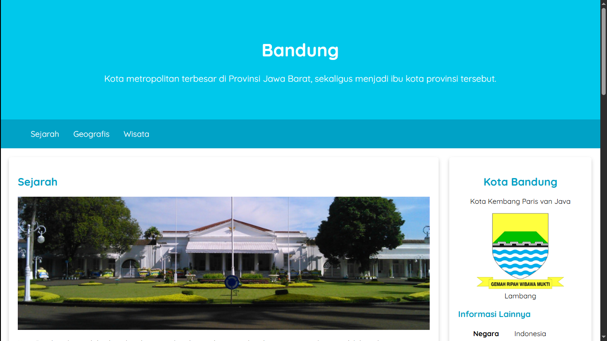

[Home](https://bayufadayan.github.io/coursework-archive/) / [Dicoding](https://bayufadayan.github.io/coursework-archive/dicoding) / Bandung Landing Page (Repository)

# Bandung Landing Page
## About  

Berikut hasil pembelajaran membuat landing page dengan menggunakan html dan css dasar. Yakni landing page tentang Kota Bandung

## Screenshot

---

    
    
    
    

  Made with ❤️ by <a href="https://github.com/bayufadayan">Bayu Fadayan</a> 
   
    

