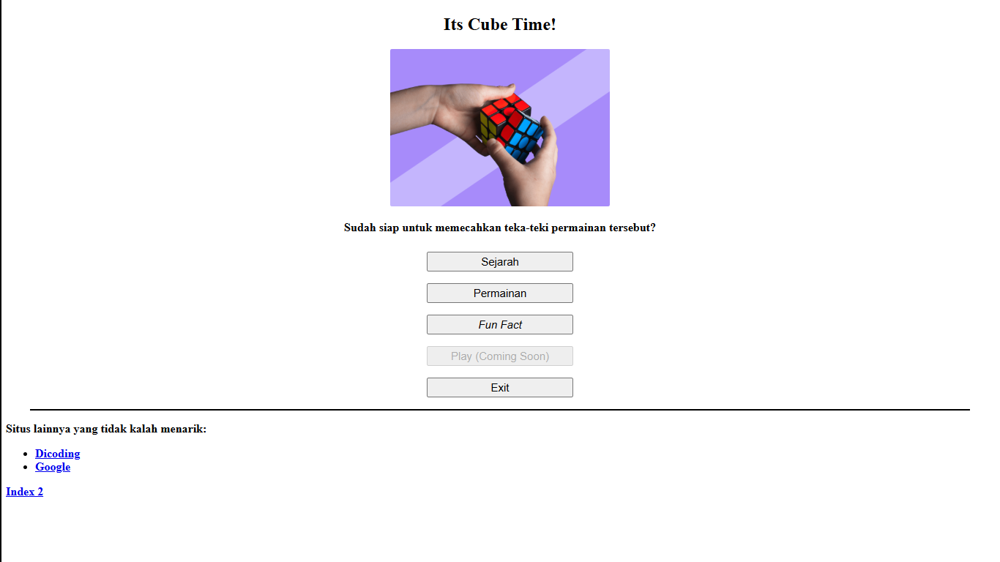
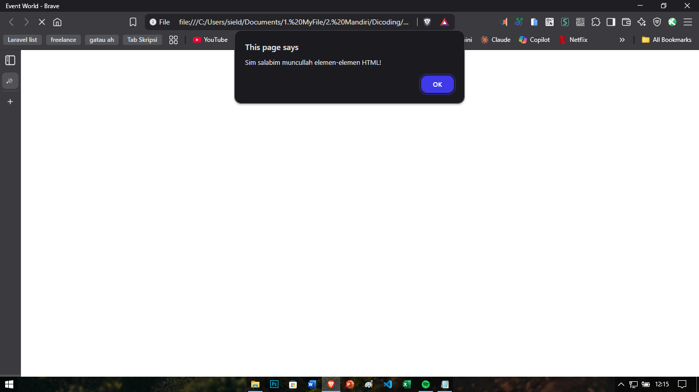
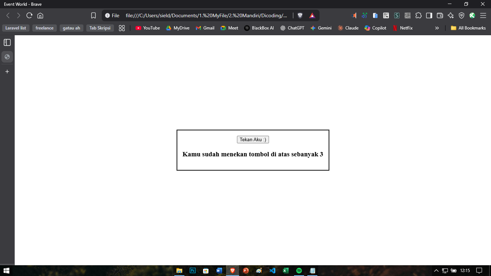
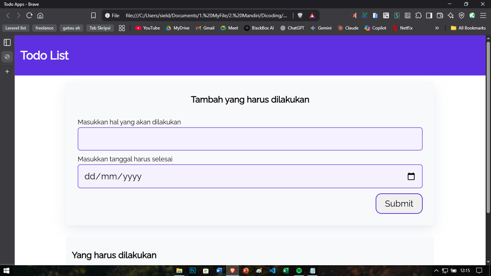
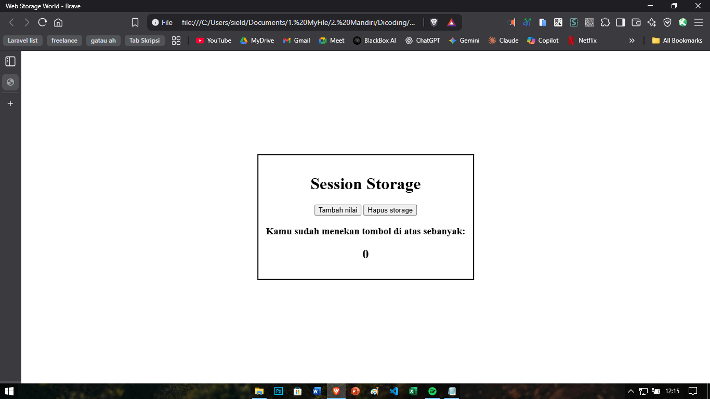
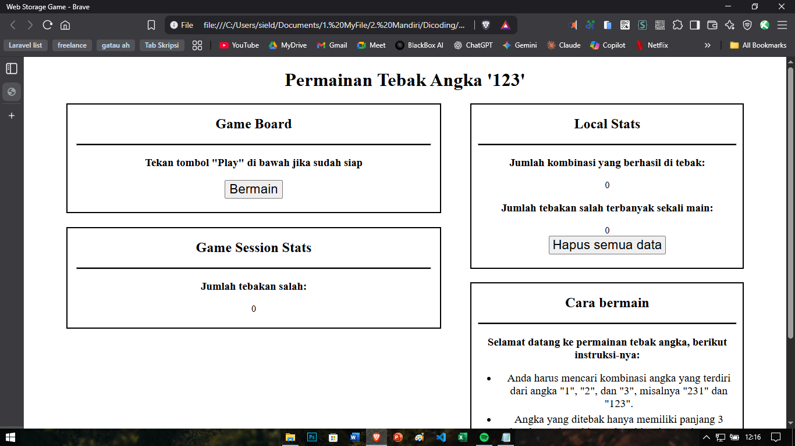
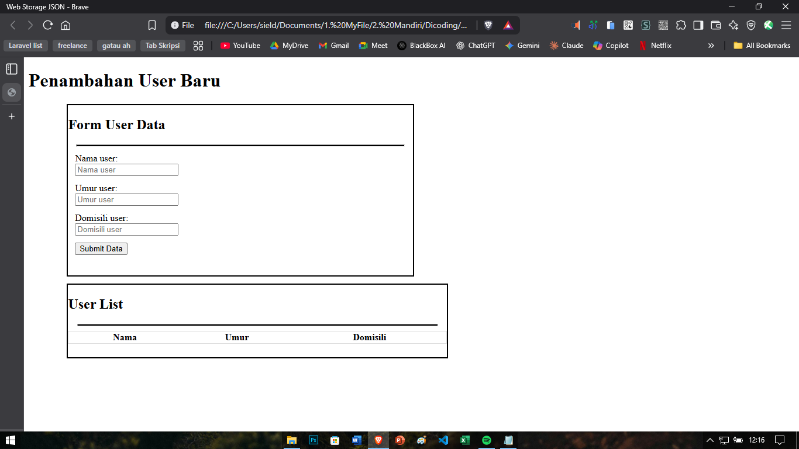

[Home](https://bayufadayan.github.io/coursework-archive/) / [Dicoding](https://bayufadayan.github.io/coursework-archive/dicoding) / Course Frontend Untuk Pemula (Repository)

# Latihan Frontend Untuk Pemula
## About  

Pembelajaran dalam membuat frontend untuk pemula melibatkan beberapa latihan. Diantaranya sebagai berikut. Latihan ini mencakup ke penerapan javascript untuk frontend agar menambah interaksifitas dengan halaman.

## Screenshot
**Latihan 1**  

**Latihan 2**  

**Latihan 3**  

**Latihan 4 (Todo App)**  

**Latihan 5 (Local Storage)**  

**Latihan 6 (Session Storage)**  

**Latihan 7 (Games Tebak Angka)**  

**Latihan 8 (Form)**  

---

    
    
    
    

  Made with ❤️ by <a href="https://github.com/bayufadayan">Bayu Fadayan</a> 
   
    
  

